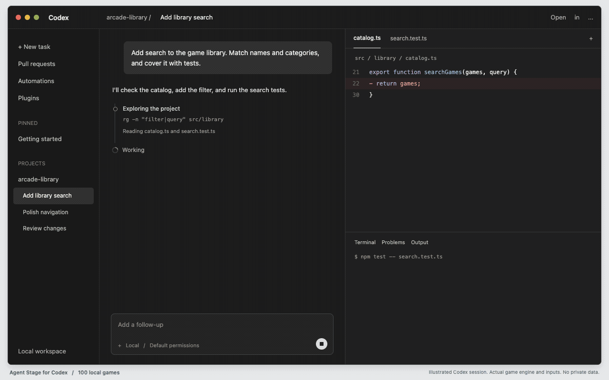

# Agent Stage



*小游戏为真实操作回放，画面为便于观看已放大；工作区与任务流程为演示，不含私人对话。[查看静态图](docs/media/readme-preview.png)。*

[English](README.md) | 简体中文

**Agent 工作，你玩游戏。 / Your agent works. You play.**

Codex 开始任务时，右下角出现一个小游戏；任务结束或中断，游戏立即停止并收起。100 款本地小游戏，随机轮换，长任务可以随时换一款。

这是社区项目，不是 OpenAI 官方产品。当前是 **macOS Beta**，不修改 Codex 安装包或主题，不需要调试端口。

## Mac：三步安装

1. 先安装、打开并登录 Codex Desktop。
2. 在 [GitHub Releases](https://github.com/lc345/codex-arcade/releases) 下载 **Agent-Stage-for-Codex.zip**，双击解压。
3. 打开解压后的文件夹，双击 **Install Agent Stage.command**。看到“安装完成”后，回到 Codex **发送一个新任务**。

安装器会打开一个终端窗口并自动完成四步检查和安装。**不用输入命令，不用执行 npm install，不用下载游戏引擎或配置 API Key。** 安装期间不要关闭窗口。安装后可以删除下载文件，已安装的游戏仍可使用。

完整 ZIP 内置 Apple Silicon 和 Intel 的 Node 运行库，安装时不另行下载依赖。不要下载 GitHub 自动生成的 **Source code (zip)** 或 **Code → Download ZIP** 来代替安装包。源码主要给开发者使用，不保证已有运行环境。

下载前确认选择带附件的 Beta Release；GitHub 自动生成的 Source code 文件不是完整安装包。

**首次打开提示：**本 Beta 尚未进行开发者签名/公证，macOS 可能拦截首次打开。先确认来源和 Release 校验和；仅在信任该文件时，按 [Apple 官方说明](https://support.apple.com/zh-cn/102445)，在“系统设置 → 隐私与安全性”中确认“仍要打开”。不要关闭 Gatekeeper 或执行全局安全绕过命令；若提示恶意软件或文件损坏，先停止安装并反馈。

[中文安装与排障](docs/QUICK_START.zh-CN.md) · [English / 安装包说明](macos/README.md) · [Windows 实验教程](docs/WINDOWS_TESTING.zh-CN.md) · [文档目录](docs/README.md)

## 装好后怎么玩

| 你做的事 | 游戏的行为 |
| --- | --- |
| 在 Codex 发送新任务 | 右下角出现宽约 400px 的游戏小窗 |
| 模型思考或执行工具 | 都可以玩，不限某种工具 |
| 鼠标移到小窗右上角 | 显示换游戏图标，可随时换一款 |
| 长任务超过三分钟 | 当前局结束且停手五秒后，随机模式可自动换游戏 |
| 切到其他 App / 最小化 Codex | 隐藏并暂停，回来继续 |
| Codex 完成或中断 | 停止输入、动画和声音，收起小窗 |
| 点击游戏后按 Esc | 只关闭本轮游戏，不停止 Codex |

小窗只显示游戏画面和必要 HUD，没有完整游戏库或多余工具栏。默认静音。全部游戏和声音设置可在安装后的 [本地游戏库](http://127.0.0.1:4173/codex-stage) 查看；游戏库的独立试玩不等于真实任务已触发。

100 款按唯一 ID 计数：95 个编译包和 5 个本地引擎页面。原来的 26 款已移除。默认轮换全部 100 款，一轮内不重复；其中 93 款仍标为 preview，7 款为精选 stable，**不宣称所有作品、所有设备都已验收**。[完整清单](docs/PLAYABLE_INVENTORY.zh-CN.md)

## 暂停、更新、卸载

- **Pause.command**：暂停游戏，不影响 Codex 工作。
- **Resume.command**：恢复；回到 Codex 发送新任务。
- **Check Agent Stage.command**：检查安装和服务。没有 CDP 调试端口是正常状态。
- **更新**：下载新 Release，再运行一次安装器。不需要先卸载；保留本地进度和偏好。
- **Uninstall Agent Stage.command**：移除本项目的服务、hooks 和运行目录，保留其他 hooks 与本地进度/媒体。

这些文件在完整安装包中。删除下载文件后，仍可从 `~/.codex/agent-stage` 找到 `Pause.command`、`Resume.command` 和 `macos/` 下的检查/卸载入口。

## 隐私与兼容范围

游戏不接收对话、命令、文件内容或工具结果，不控制 Agent。事件接口使用本机回环地址和随机 token；不上传活动记录。安装器只合并自己的 hooks，不绕过 Codex 的信任机制。

- 当前支持路径：本地 **macOS Codex Desktop**；远端任务和组织禁用 hooks 的环境不保证可用。
- 小窗是跟随 Codex 的独立 WebKit 窗口，不是修改 Codex 内部 UI。
- Apple Silicon 本机已验证；Intel 运行库已包含，Intel 实机及更多 macOS 版本仍待验证。
- Windows 目前仅提供网页试玩实验步骤，**没有 Windows 一键安装器或自动小窗**。
- 本 Beta 尚未签名/公证；不承诺没有系统安全提示。

## 开发者与社区

下载源码后，已有 Node 22+ 的开发者可以在仓库根目录运行：

```sh
node apps/press-lab/server.js
```

打开 `http://127.0.0.1:4173/codex-stage`。不需要构建引擎；源码包含已审查的本地依赖和游戏资源。Mac 源码用户也可以双击根目录 `Install.command`，但需要可用的 Node 22+；普通用户应下载完整 Release。

| 路径 | 内容 |
| --- | --- |
| `apps/codex-stage` | 游戏、目录、资源和网页宿主 |
| `packages/codex-stage` | 脱敏活动事件、hooks 和本地服务 |
| `macos` | Mac 安装器、窗口、诊断和打包 |
| `tools` | 游戏构建、回放、性能和安装包验收 |
| `docs` | 玩法、贡献、安全和发布说明 |
| `games` | Godot 游戏的可编辑源码 |
| `skills` | 可复用的游戏创作指南 |

`dist/`、`output/`、`.tools/`、用户配置、任务记录和依赖缓存不进入源码仓库；Node 二进制仅进入完整 Release。`npm run audit:public` 检查公开文件白名单、常见凭证格式、本机路径和超大文件，但不替代人工安全与素材许可审核。

欢迎贡献新游戏、关卡、音效和改进建议。代码通过 PR 审查后才进入发行包，不从互联网自动执行任意社区 JavaScript。素材必须明确来源和许可证。

[贡献指南](CONTRIBUTING.md) · [游戏创作 Skill](skills/agent-stage-microgame-director/SKILL.md) · [发布流程](docs/RELEASING_CODEX_STAGE.md) · [性能复现与修复](docs/COMPANION_PERFORMANCE.zh-CN.md) · [安全说明](SECURITY.md)

FinalButton、ActionProof、Scene Pack 等历史模块保留兼容；它们不是安装或玩游戏的前置要求。[历史架构说明](TRUSTED_ACTIONS.md)

代码采用 [Apache-2.0](LICENSE)。[第三方库与素材许可索引](docs/ASSET_LICENSES.md)列出各自的许可证和来源。项目由 Speakon 发起，但不需要购买任何硬件。
